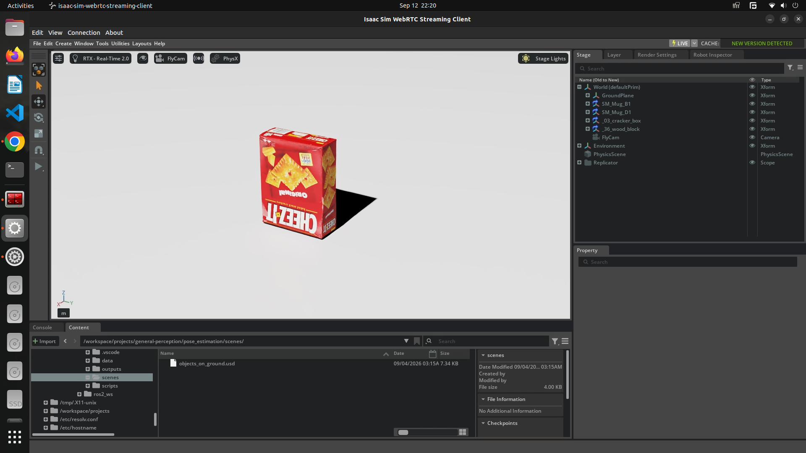

# general-perception

A collection of computer-vision and 3D-perception projects, mostly built in **NVIDIA Isaac Sim** and **ROS 2**, with a focus on AI, ML and DL. It is my practice and learning space: each folder is a self-contained project or package, and more will be added over time.



## Contents

| Project | What it is | Folder |
|---|---|---|
| **[Pose Estimation](pose_estimation/)** | A 6-DoF object pose pipeline on synthetic Isaac Sim RGB-D data. Multi-view point cloud reconstruction (known extrinsics and FPFH + RANSAC + ICP), object isolation and PCA-based pose, using classical geometry with Open3D. | [`pose_estimation/`](pose_estimation/) |
| **[Grounding DINO (ROS 2)](ros2_ws/src/dino/)** | A ROS 2 package that runs the Grounding DINO open-vocabulary detector on a live Isaac Sim camera. The text prompt can be changed at runtime without restarting the simulation. | [`ros2_ws/src/dino/`](ros2_ws/src/dino/) |
| **[SAM (ROS 2)](ros2_ws/src/sam/)** | A ROS 2 package that runs Segment Anything (SAM 2) on the camera feed, prompted by the boxes from the DINO package, and publishes instance masks. | [`ros2_ws/src/sam/`](ros2_ws/src/sam/) |
| **[Isaac Sim workspace](isaac_sim_ws/)** | Shared Isaac Sim scenes and assets (rooms, lights, objects) used by the projects above. | [`isaac_sim_ws/`](isaac_sim_ws/) |

Project pages with videos and write-ups (served from this repository with GitHub Pages):

- [Pose Estimation](https://vihaan30g.github.io/general-perception/pose_estimation/)
- [Grounding DINO package](https://vihaan30g.github.io/general-perception/ros2_ws/src/dino/)

## How the pieces fit

The two ROS 2 packages form the start of a perception pipeline, with Isaac Sim providing the camera images:

```
Isaac Sim camera  ->  dino (find objects from a text prompt)  ->  sam (segment them)
```

The pose estimation project is separate and needs no ROS or deep learning: it works directly on depth data and point clouds.

## Repository structure

```
general-perception/
├── isaac_sim_ws/        Isaac Sim scenes and assets
│   ├── assets/          rooms, lights and objects (USD / STL)
│   └── scenes/          Isaac Sim scenes
├── pose_estimation/     6-DoF pose estimation pipeline (Open3D)
│   ├── data/            captured RGB-D frames
│   ├── scenes/          scene used for capture
│   └── scripts/         numbered pipeline steps
├── ros2_ws/
│   └── src/
│       ├── dino/        Grounding DINO ROS 2 package
│       └── sam/         SAM ROS 2 package
└── images/              images used in the documentation
```

## Getting started

```bash
git clone https://github.com/Vihaan30g/general-perception.git
cd general-perception
```

Each project has its own requirements and run instructions. Pose estimation runs from its `scripts/` folder with `open3d` and `numpy`. The ROS 2 packages are built with `colcon build` from `ros2_ws/` and need an Isaac Sim scene publishing a camera image.

## Author

**Vihaan Gupta** · [GitHub](https://github.com/Vihaan30g) · vihaan30g@gmail.com
